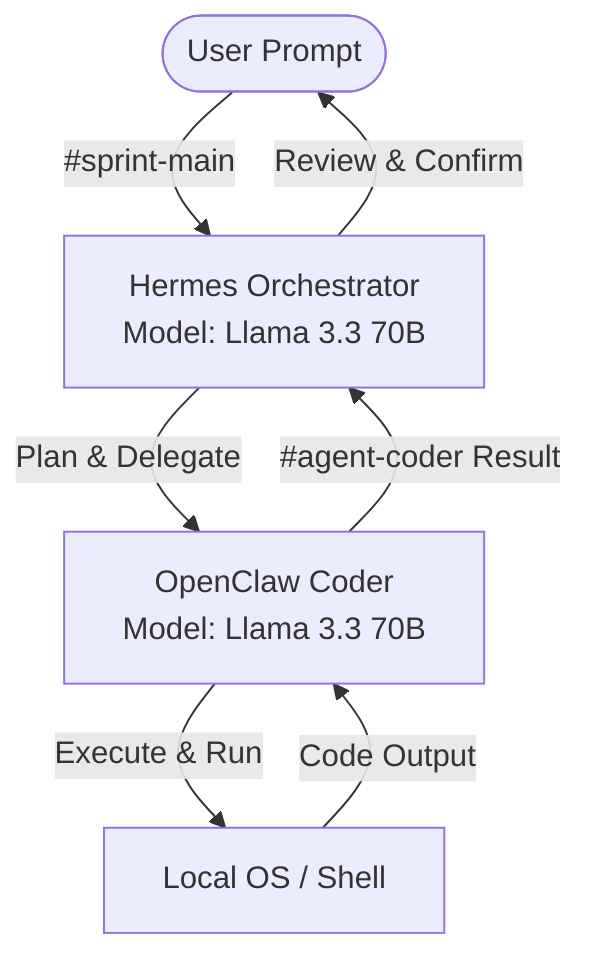

# System Architecture — Hermes + OpenClaw

This document details the multi-agent system architecture used for the NMG Labs Forge Sprint 02 qualifier.

## 1. Agent Division of Labor

### Brain (Orchestrator): Hermes Agent
- **Role:** Handles high-level goal decomposition, planning, memory search, quality validation, and delegation.
- **Provider & Model:** Meta Llama 3.3 (70B Instruct) via OpenRouter.
- **Behavior:** Listens in `#sprint-main` (or Direct Messages), breaks tasks down into a structured plan, delegates tasks to the coder agent in `#agent-coder`, and reviews the final output.

### Hands (Coder): OpenClaw Agent
- **Role:** Executes the actual coding tasks, creates files, runs shell commands, tests code, and reviews logs.
- **Provider & Model:** Llama 3.3 (70b-versatile) via Groq.
- **Behavior:** Listens in `#agent-coder` for delegations from Hermes, writes python/javascript code, tests it locally, and reports completion status back to the channel.

---

## 2. Slack Channel Configuration

All agent activities and user communications are transparently mapped to the following Slack channel scheme:

| Channel Name | Primary Purpose | Participants |
| :--- | :--- | :--- |
| `#sprint-main` | High-level planning, human steering, plan approval, and status reporting. | User, Hermes |
| `#agent-coder` | Hermes delegates specific implementation tasks to OpenClaw; OpenClaw reports code output. | Hermes, OpenClaw |
| `#agent-log` | Raw autonomous agent logs, cron job outputs, and background status reporting. | Hermes, OpenClaw |

---

## 3. Model Routing Rationale

- **Hermes (Llama 3.3 70B):** We route Hermes to a high-capacity model because planning, context retention, and multi-step reasoning require high coherence and semantic understanding.
- **OpenClaw (Llama 3.3 70b):** We route OpenClaw to Groq's high-speed endpoint because fast code-generation iterations allow rapid testing, code modification, and quick recovery from syntax/logic errors.
